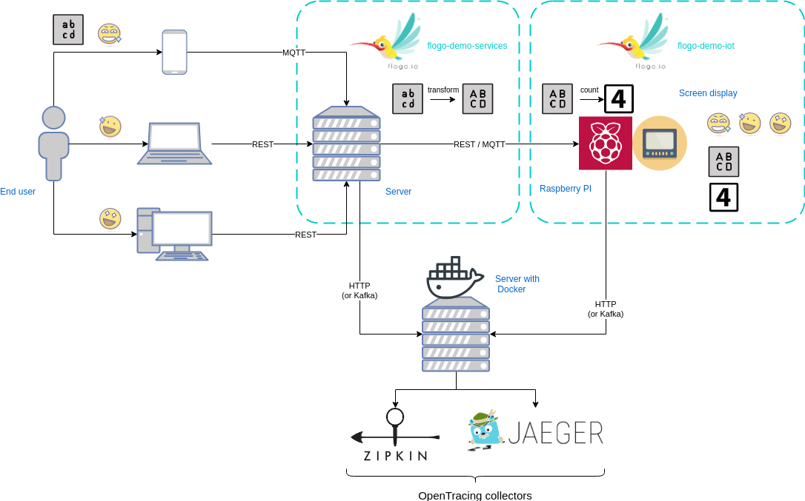

# Flogo demo by Square IT Services

The Flogo demo by *Square IT Services* aims at covering the maximum of features used by
[our company](#square-it-services) to implement successful solutions for our clients in an easy to run and fast to
understand demonstration.

It includes:
* micro-services based architecture
* classic flows (REST) : [**flogo-demo-services** repository](https://github.com/square-it/flogo-demo-services)
* IoT flows (Raspberry PI) with a focus on edge computing : [**flogo-demo-iot** repository](https://github.com/square-it/flogo-demo-iot)
* use of [custom-made activities](https://github.com/square-it/flogo-contrib-activities) of *Square IT Services*
* distributed tracing at scale with a custom-made [OpenTracing listener](https://github.com/square-it/flogo-opentracing-listener)

## Architecture

## Square IT Services

A french IT consulting company : http://www.sqits.net